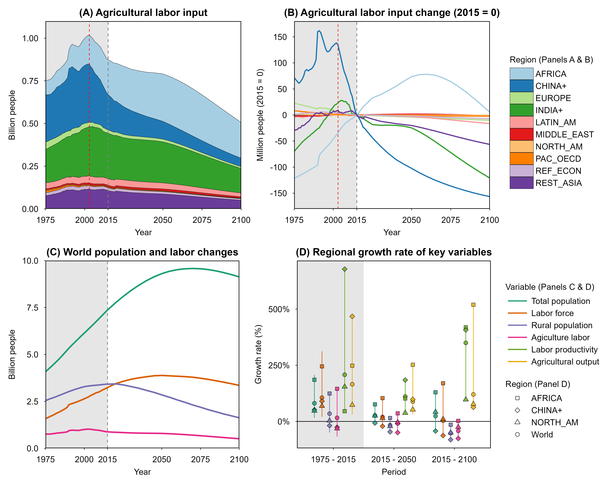

Fig. 1 Historical trends and future projections of agricultural labor-related metrics. Panel (A) presents agricultural labor input by region (stacked areas; see Table S2 for R10 region mappings), and Panel (B) shows the corresponding changes (lines) over time. Panel (C) shows changes in population and labor-related metrics at the world level. Panel (D) shows the growth rate of key variables by region and period. The point-range plots show values for key regions (shape of the point) and R10 region ranges (whiskers). Vertical dotted lines, where applicable, highlight 2003 (red) and 2015 (gray). Data in 2015 or earlier (gray background areas) are historical observations compiled based on USDA or ILO data (Methods). Data after 2015 are projections from the SSP database (population and labor force) or GCAM (agricultural labor, labor productivity, and output). The agricultural labor data presented labor in the primary crop, livestock, and forestry production but did not include labor in the fishery sector (3% globally).