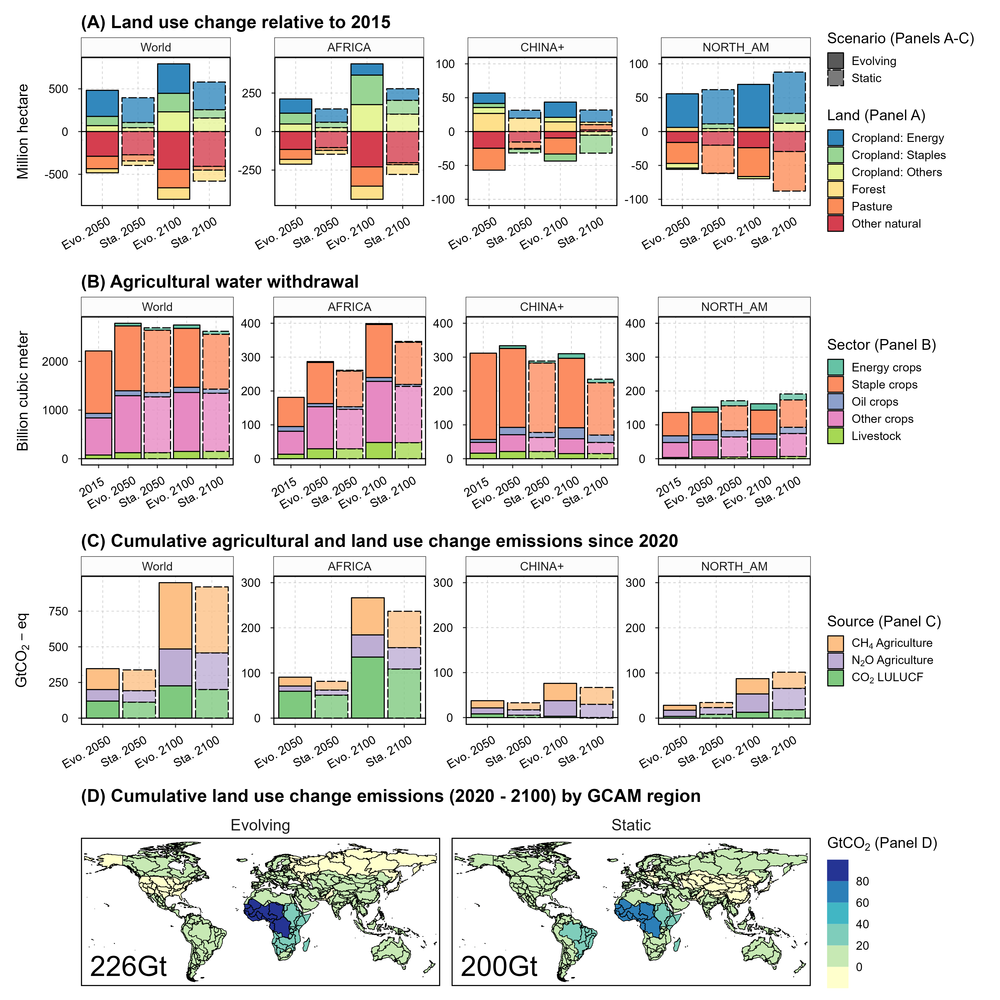

# Overview

This repository includes an R project (R codes, functions, and data) for generating key figures in the paper:

**Agroeconomic and environmental implications of future labor market evolution**  

Di Sheng, James A. Edmonds, Pralit Patel, Stephanie T. Waldhoff, Brian C. O’Neill, Marshall A. Wise, Xin Zhao* 

Joint Global Change Research Institute, Pacific Northwest National Laboratory  
*Corresponding Author. Email: xin.zhao@pnnl.gov


# Instruction
## Access to the data needed
The source csv files (queried from GCAM output database) can be downloaded at the Zenodo archive: 


## Running the R project
Download the entire R project and run `R/main.R`. The script load data and source different R scripts to generate figures or datasets related to historical data and GCAM results. These scripts may further  source and run functions to generate figures and datasets, which will be saved in  `output/AgLabpr/AgLabor`.


## Package output and size
The package output includes figures and datasets (`output/*` included in this repo). 
The size of the output figure folder is about 40MB. 
The ProjectRDS data folder is about 170MB. 
The raw csv data (not required) is about 270MB

## R Session Information (renv used but deacviated)

```
R version 4.1.0 (2021-05-18)
Platform: x86_64-w64-mingw32/x64 (64-bit)
Running under: Windows 10 x64 (build 19045)

Matrix products: default

locale:
[1] LC_COLLATE=English_United States.1252  LC_CTYPE=English_United States.1252   
[3] LC_MONETARY=English_United States.1252 LC_NUMERIC=C                          
[5] LC_TIME=English_United States.1252    

attached base packages:
[1] stats     graphics  grDevices utils     datasets  methods   base     

other attached packages:
 [1] sf_1.0-1           cowplot_1.1.1      RColorBrewer_1.1-2 patchwork_1.1.1    purrr_1.0.1       
 [6] gcamdata_5.1       dplyr_1.0.6        scales_1.1.1       ggsci_2.9          ggplot2_3.3.5     
[11] stringr_1.4.0      tidyr_1.1.3       

loaded via a namespace (and not attached):
 [1] Rcpp_1.0.8.3       pillar_1.7.0       compiler_4.1.0     class_7.3-19       tools_4.1.0       
 [6] digest_0.6.27      lifecycle_1.0.4    tibble_3.1.2       gtable_0.3.0       pkgconfig_2.0.3   
[11] rlang_1.1.0        DBI_1.1.1          cli_3.6.1          rstudioapi_0.13    e1071_1.7-7       
[16] s2_1.0.6           withr_2.5.0        systemfonts_1.0.4  generics_0.1.0     vctrs_0.6.1       
[21] hms_1.1.1          classInt_0.4-3     grid_4.1.0         tidyselect_1.1.1   svglite_2.1.1     
[26] glue_1.4.2         data.table_1.14.0  R6_2.5.0           textshaping_0.3.6  fansi_0.4.2       
[31] farver_2.1.0       readr_1.4.0        magrittr_2.0.1     units_0.7-2        ellipsis_0.3.2    
[36] assertthat_0.2.1   colorspace_2.0-1   ragg_1.2.2         labeling_0.4.2     KernSmooth_2.23-20
[41] utf8_1.2.1         proxy_0.4-26       stringi_1.6.1      wk_0.4.1           munsell_0.5.0     
[46] crayon_1.4.1 
```

Key Figures

Fig. 1 Historical trends and future projections of agricultural labor-related metrics. Panel (A) presents agricultural labor input by region (stacked areas; see Table S2 for R10 region mappings), and Panel (B) shows the corresponding changes (lines) over time. Panel (C) shows changes in population and labor-related metrics at the world level. Panel (D) shows the growth rate of key variables by region and period. The point-range plots show values for key regions (shape of the point) and R10 region ranges (whiskers). Vertical dotted lines, where applicable, highlight 2003 (red) and 2015 (gray). Data in 2015 or earlier (gray background areas) are historical observations compiled based on USDA or ILO data (Methods). Data after 2015 are projections from the SSP database (population and labor force) or GCAM (agricultural labor, labor productivity, and output). The agricultural labor data presented labor in the primary crop, livestock, and forestry production but did not include labor in the fishery sector (3% globally).


Fig. 3 Impact of agricultural labor market evolution on key agroeconomic outcomes.   


Fig. 4 Impact of agricultural labor market evolution on key environmental outcomes.  
